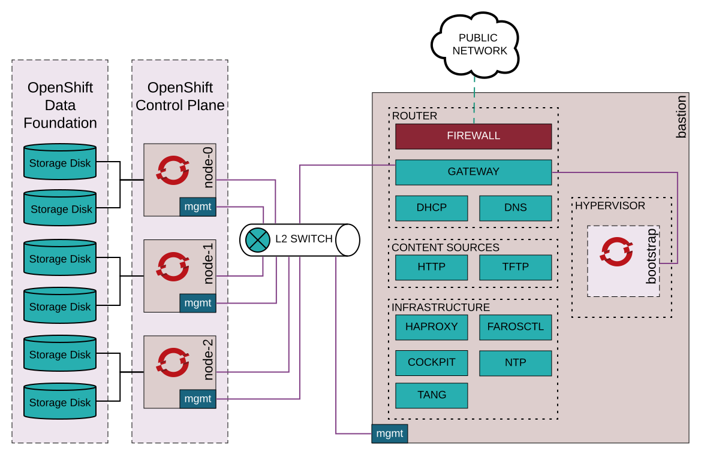

:github_url: https://github.com/project-faros/faros.dev/blob/master/source/architecture.rst

Cluster Architecture
====================

Philosophy
----------

The Faros reference architecture is specifically designed to support far edge
environments. For this reason: things like minimal power draw, minimal heat
production, and minimal footprint take priority to concerns like high
availability. This architecture is not the best solution for a data center,
but is appropriate for use cases like remote branch offices, remotely
deployable computing, IoT gateways, and far edge.

The cluster is also designed to be entirely self-sustaining and not dependent
on other infrastructure.

Overview
--------

    Faros Cluster Overview

The default deployed cluster will consist of four bare metal machines: a
bastion node and 3 cluster nodes. The bastion node will host all of the
infrastructure and services required for the cluster to operate. A layer 2
switch will connect all four nodes, and the bastion node will also connect to a
public network. Each of the four nodes must also have an out-of-band management
interface that is on the same layer 2 network as the nodes themselves. The
bastion node runs Red Hat Enterprise Linux 8 whereas the other three nodes will
run Red Hat CoreOS.

Bastion node detail
-------------------

The bastion node serves four primary services to the cluster.

Router
    The bastion node connects directly to the upstream public network and is
    responsible for routing traffic and applying firewall policies. For
    firewall services, firewalld is used. The default set of rules are
    configurable. DHCP and DNS services for the cluster are also provided by
    the bastion node using ISC DHCP and Bind respectively. In addition to the
    pubic network link, the bastion node should also have a link to a private
    layer 2 switch. If there are more than two NICs on the bastion node,
    additional NICs may be placed on the internal network.

Content Sources
    During the OpenShift install, two content repositories are required. The
    first is an HTTP server that is used to host the ignition files. These
    files are like Kickstart files in that they control the operating system
    installation of Red Hat CoreOS on the cluster nodes. A TFTP server is also
    hosted for the installation. This server contains the Red Hat CoreOS
    sources required to PXE boot cluster nodes into the operating system
    installation. If a known cluster node attempts to PXE boot on the network,
    it will be directed to a Red Hat CoreOS installation. These services are
    only required when creating the cluster and adding nodes to the cluster.
    They can be shutdown during normal operation of the cluster.

Infrastructure
    For an OpenShift cluster to operate, a Layer 4 load balancer must exist to
    balance requests for the cluster API, machine configurations, and the
    OpenShift ingress router. For this the bastion node will run HAProxy. Also
    included are the `farosctl` command and the Cockpit web interface for
    managing the cluster. Finally, NTP services are provided by the
    infrastructure node. The DHCP server will announce the availability of the
    NTP services and the cluster nodes will synchronize with the bastion.

Hypervisor
    During the Faros installation, the bastion node will be configured to allow
    it to host virtual machines on the internal LAN. By default, only a
    virtual bootstrap server will be created on the bastion node. This node is
    used to host a minimal Kubernetes API that allows the cluster installation
    to begin. After installation, this machine is shutdown and no longer needed
    unless the cluster is redeployed. Currently, no other virtual machines are
    created on the bastion node, but virtual machines can be manually created
    after installation.

Network detail
--------------

There are only two network requirements for a Faros deployed cluster. One
uplink/WAN connection to the bastion node and a layer 2 switch connecting all
of the nodes and management ports. The bastion node will act as a gateway for
ingress and egress traffic. During install, the gateway can be configured in
one of two ways:

  * NAT Gateway - Nodes outside of the cluster may use the bastion node as part
    of a static route to contact the cluster nodes directly. This is only
    recomended when the bastion node is connected to a trusted enterprise
    network as it allows direct access to the cluster nodes.
  * PAT Gateway - The bastion node will only forward traffic from the cluster
    network to the public network. The bastion node's firewall will port
    forward the cluster services to make them available outside of the cluster.
    This is safer because only the bastion node is reachable from outside of
    the cluster. This configuration is very similar in function to a consumer
    router.

DNS requirements
----------------

Setting up a cluster requires a DNS domain and a cluster name. The cluster will
be configured to use a subdomain of \*.CLUSTER_NAME.CLUSTER_DOMAIN. For
example, if your cluster name is `edge` and your cluster domain is
`example.com`, then your bastion node would have a FQDN of
`bastion.edge.example.com`. If you would like your cluster to be reachable
externally (usually desired, but not necessary), you must have the ability to
create DNS records in the DNS zone that defines your domain. It is not required
to edit the DNS zone until the installation is complete.

.. important::

    In order to contact the cluster externally, you must be able to create 3
    public DNS A records:

    * bastion.CLUSTER_NAME.CLUSTER_DOMAIN
    * api.CLUSTER_NAME.CLUSTER_DOMAIN
    * \*.apps.CLUSTER_NAME.CLUSTER_DOMAIN
